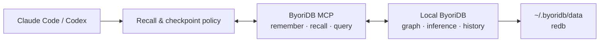

# ByoriDB

> **Claude Code와 Codex가 프로젝트를 매번 처음부터 다시 배우지 않게 하는 로컬 지식 그래프.**

ByoriDB는 코딩 에이전트가 작업 중 확정한 **모듈 구조, 결정과 근거, 반복되는 버그,
인시던트와 해결책**을 로컬 PC에 오래 보존하고 다음 세션에서 다시 탐색하게 만드는
agent memory substrate입니다.

목표는 LLM이 문서를 요약해 주는 평면 위키가 아닙니다. 프로젝트 지식을 typed node와
causal edge로 연결하고, 관계·시점·추론 근거를 따라가며 “무엇인가”뿐 아니라
**“왜 이렇게 되었는가”**까지 되짚는 시스템입니다.

> [!WARNING]
> 현재는 초기 실험 단계입니다. 로컬 단일 노드, MCP surface, 기본 notes schema는 구현되어
> 있지만 `memory_remember`의 deterministic VID가 음수가 될 때 planner가 거부하는 알려진 버그가
> 있습니다. 저장소 전체 자동 수집과 typed wiki 자동 부트스트랩도 아직 개발 중입니다.
> 중요한 데이터의 유일한 저장소로 사용하지 마세요.

## 문서형 LLM Wiki와 무엇이 다른가

| 문서형 위키 / RAG | ByoriDB가 지향하는 방식 |
|---|---|
| 페이지와 요약을 검색 | module, decision, bug, incident를 typed graph로 연결 |
| 키워드·유사도 중심 recall | `GO`/`MATCH`로 원인, 영향, 대체 관계를 traversal |
| 최신 문서만 유지 | bitemporal history와 `AS OF`로 과거 상태 조회 |
| 결론을 텍스트로 저장 | 추론 edge의 provenance를 `WHY`로 설명 |
| 자유 추출로 중복이 쌓임 | 좁은 ontology와 canonical name으로 엔티티를 관리 |
| 외부 서비스에 의존 가능 | redb 기반 데이터와 MCP 서버를 로컬에 보관 |

예를 들어 다음 관계를 남기면 이후 에이전트는 증상만 검색하지 않고 원인과 해결 결정,
영향받은 모듈까지 한 흐름으로 탐색할 수 있습니다.

```text
incident ──caused_by──> bug ──fixed_by──> decision ──affects──> module
                                      └──supersedes──> previous decision
```

## 동작 방식



skill은 에이전트가 작업 시작 시 관련 기억을 조회하고, 결정·버그 해결·인시던트 종료 같은
체크포인트에서 durable knowledge를 기록하도록 안내합니다. MCP는 실제 읽기/쓰기 도구를
제공하고, hook은 그 시점을 상기시킵니다. 현재 hook은 **리마인더만 주입**하며 MCP를 직접
호출하지 않습니다. 기록 여부와 내용은 아직 에이전트가 판단합니다.

## 지금 가능한 것

| 상태 | 기능 |
|---|---|
| ✅ | 로컬 서버, 상시 실행 서비스, redb 영속 저장 |
| ✅ | MCP 도구 surface: `memory_remember`, `memory_recall`, `memory_query` |
| ✅ | `note` + `rel` 기본 memory schema 자동 생성 |
| ✅ | Claude Code용 MCP 등록과 memory skill 원커맨드 설치 |
| ✅ | DB core: graph traversal, 선택된 RDFS-Plus/OWL 2 RL 규칙, `WHY`, temporal history |
| ⚠️ | 기본 note write — 이름 hash가 음수 VID이면 현재 planner에서 실패하는 버그 존재 |
| 🟡 | 체크포인트 capture — hook reminder + agent-driven write |
| 🟡 | typed causal wiki — dogfood PoC 검증, clean install 자동 schema 생성은 미구현 |
| 🟡 | Codex — MCP와 skill을 수동 연결해 사용 가능, 설치기 자동 wiring은 미구현 |
| ⬜ | repository/code/git 자동 ingestion과 entity extraction |
| ⬜ | semantic recall pipeline과 wiki UI |

## 빠른 시작

사전 요구사항은 `curl`, `tar`, `python3`입니다. 사전 빌드 바이너리는 macOS
(Apple Silicon/Intel)와 Linux x86_64를 지원합니다.

### Claude Code

```bash
curl -fsSL https://github.com/byoridb/byoridb/releases/latest/download/install.sh | bash

curl -s http://127.0.0.1:19669/health
claude mcp list
```

체크포인트 reminder hook도 설치하려면 `jq`를 준비한 뒤 다음처럼 실행합니다.

```bash
curl -fsSL https://github.com/byoridb/byoridb/releases/latest/download/install.sh \
  | bash -s -- --with-hooks
```

현재 installer의 hook merge는 기존 `SessionStart`/`PreToolUse` 배열을 교체할 수 있으므로
`~/.claude/settings.json`을 먼저 백업하세요.

설치 후 Claude Code를 재시작하세요. 서버·MCP·skill의 상세 위치와 제거 방법은
[설치기 문서](installer/README.md)를 참고합니다.

### Codex

현재 설치기는 Codex를 자동 등록하지 않습니다. 위 기본 설치를 마친 뒤 MCP와 skill을
수동으로 연결합니다.

```bash
codex mcp add byoridb -- "$HOME/.byoridb/bin/run-mcp.sh"

mkdir -p "$HOME/.codex/skills/byoridb-memory"
cp "$HOME/.claude/skills/byoridb-memory/SKILL.md" \
  "$HOME/.codex/skills/byoridb-memory/SKILL.md"

codex mcp list
```

Codex를 재시작한 뒤 새 세션에서 사용합니다. Claude용 hook은 Codex에 설치되지 않습니다.

## Memory surface

| 도구 | 역할 |
|---|---|
| `memory_remember(name, kind, body, relates_to?)` | 안정적인 이름으로 note를 저장하거나 갱신 |
| `memory_recall(text?, kind?, limit?)` | note 이름·본문에서 이전 기억을 조회 |
| `memory_query(ngql)` | traversal, typed wiki, 집계, `AS OF`를 위한 raw nGQL |

현재 기본 설치는 독립적인 사실과 간단한 연결을 위한 `note`/`rel` schema를 생성합니다.
다만 일부 canonical name이 음수 VID로 hash될 때 `memory_remember`가 실패하는 알려진 버그가
있어, 이를 고치기 전까지 기본 write path를 신뢰할 수 있는 상태로 보지 않습니다.
`module`, `decision`, `bug`, `incident`, `concept`, `task`와 typed edge로 구성된 causal wiki는
[Memory-Wiki 설계와 PoC](docs/MEMORY_WIKI_DESIGN.md)에 검증되어 있지만, 새 설치에서 해당
schema를 자동 생성하는 작업은 남아 있습니다.

데이터 파일과 MCP process는 로컬에 머물지만, recall된 내용은 에이전트가 사용할 때
Claude/Codex의 model context로 전달될 수 있습니다. 비밀번호, token, credential 같은 secret은
memory에 저장하지 마세요.

## Graph database core

Memory 제품 아래에는 범용 semantic graph database core가 있습니다.

- property graph와 nGQL: `MATCH`, `GO`, `LOOKUP`, `FETCH`, `FIND PATH`
- class hierarchy와 선택된 RDFS-Plus/OWL 2 RL 규칙의 write-time materialization
- transitive, symmetric, inverse, subproperty, equivalent property, 2-link property chain
- inference provenance와 `WHY`, DELETE EDGE의 provenance 기반 incremental retraction
- 명시적 `sameAs` canonical merge
- asserted vertex/edge history와 vertex `FETCH ... AS OF <epoch-ms>`
- 구조·embedding·hybrid similarity recommendation
- HTTP/gRPC API, CLI, backup/restore, Prometheus metrics

전체 OWL 2 RL이나 완전한 temporal graph query를 지원한다는 뜻은 아닙니다. 상세 기능 범위,
제약, 운영 이력은 [docs/PLAN.md](docs/PLAN.md)를 참고하되 날짜가 적힌 운영 상태는 live
환경에서 다시 확인해야 합니다.

## 현재 한계

- 저장소, 문서, symbol, git diff를 자동으로 읽어 graph로 만드는 ingestion pipeline은 아직 없습니다.
- capture는 매 턴 자동 추출이 아니라 체크포인트에서 에이전트가 수행합니다.
- `memory_remember`의 signed name hash와 INSERT planner 사이 음수 VID 호환 버그가 남아 있습니다.
- 기본 `memory_recall`은 note 이름·본문 substring 검색이며 core의 vector search를 사용하지 않습니다.
- typed wiki schema와 Codex wiring은 아직 원클릭 설치 대상이 아닙니다.
- temporal v1의 공개 조회는 vertex `FETCH ... AS OF`에 한정됩니다. current/history dual-write도 비원자적입니다.
- inference `WHY`는 rule/premise provenance이며, 파일·commit·대화 출처 lineage와는 다릅니다.
- 로컬 standalone이 주 사용 경로입니다. 운영용 multi-node 배포 wiring은 완성되지 않았습니다.

## 다음 목표: automatic project knowledge graph

“자동”은 모든 대화를 무차별 추출한다는 뜻이 아닙니다. 작업 종료, commit, PR, 인시던트
해소처럼 지식이 확정되는 경계에서만 구조화해 graph가 junk drawer가 되는 것을 막습니다.

1. typed wiki ontology를 단일 schema로 확정하고 fresh install에 자동 bootstrap
2. Claude Code/Codex checkpoint event에서 decision·bug·incident를 안전하게 capture
3. repository의 module, symbol, dependency, document, git change를 project-aware하게 indexing
4. canonical name과 merge candidate로 같은 엔티티의 파편화 방지
5. traversal + temporal + semantic ranking을 결합한 recall과 읽기 좋은 wiki surface 제공

## 소스에서 빌드

Rust 1.90(`rust-toolchain.toml`)과 `protobuf-compiler`가 필요합니다.

```bash
cargo build --release
BYORIDB_ROOT_PASSWORD='<password>' cargo run --release --bin byoridb-server
BYORIDB_USER=root BYORIDB_PASSWORD='<password>' \
  cargo run -p byoridb-client --bin byoridb-cli

cargo fmt --all -- --check
cargo clippy --workspace --all-targets --all-features -- -D warnings
cargo test --workspace --all-features -- --test-threads=1
```

## 문서

- [로컬 memory 설치기](installer/README.md)
- [Agent memory 자산](docs/agent-memory/README.md)
- [Memory-Wiki ontology와 PoC](docs/MEMORY_WIKI_DESIGN.md)
- [DB 빠른 시작](QUICKSTART.md)
- [상세 제약, 로드맵, 운영 이력](docs/PLAN.md)
- [기여 가이드](CONTRIBUTING.md)

## 라이선스

[Apache License 2.0](LICENSE)
